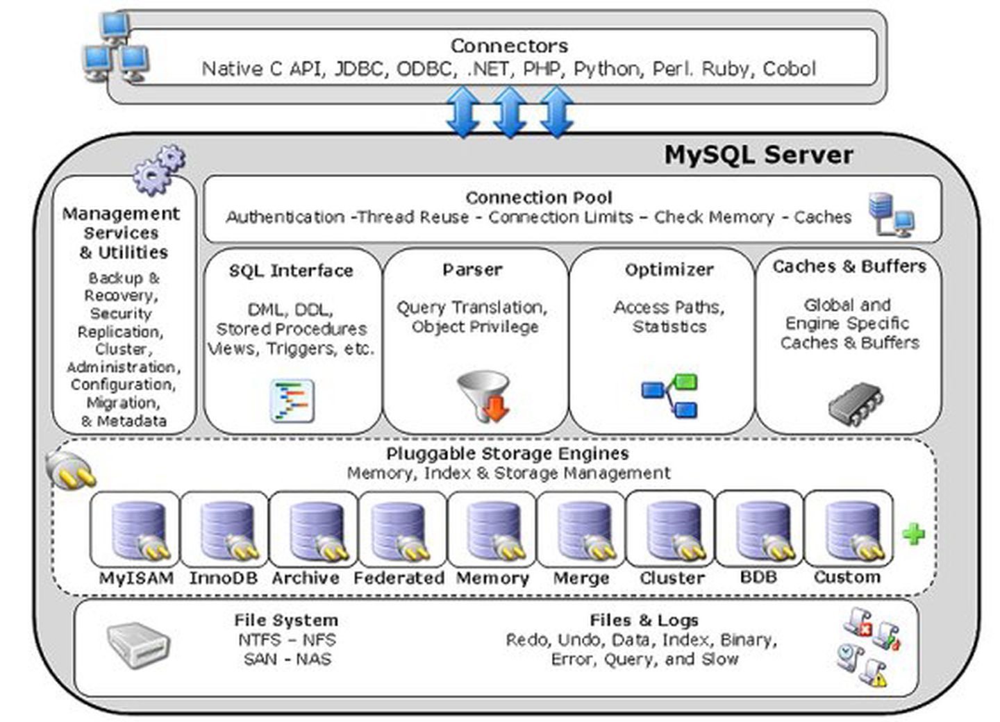
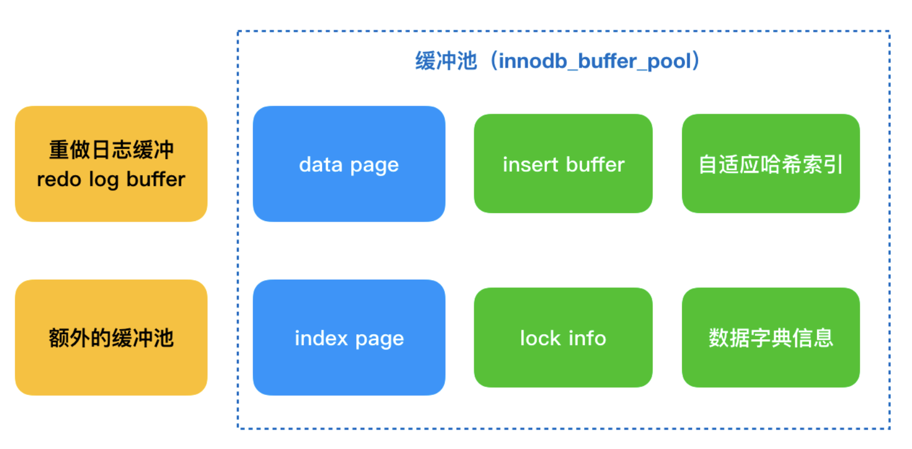
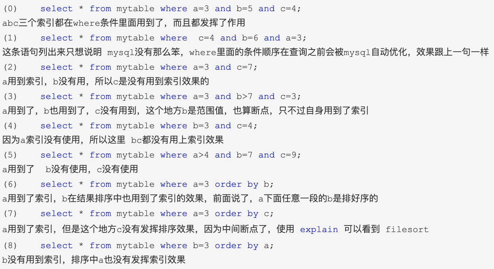

## 一、mysql架构

#### 1.架构图



#### 2.逻辑架构图


[mysql组件介绍](https://www.cnblogs.com/wangjiming/p/10410904.html)


## 二、内存缓冲池

#### 1.架构图


#### 2.结构图



#### 3.内存管理

通过LRU算法实现，最频繁的页存在列表的前端，不频繁使用的放在后端

[内存管理实现](https://www.jb51.net/article/209151.htm)


#### 4.insert buffer

针对非唯一辅助索引的插入缓冲，底层数据结构为b+数。在合适的时机会批量与磁盘的辅助索引进行merge。主要为了提升数据库的插入性能。后续还有delete buffer和purge buffer
[insert buffer介绍](https://zhuanlan.zhihu.com/p/86085906)

#### 5.doublewrite

作用: InnoDB崩溃恢复，redo恢复数据的前提是页是完整干净的，corrupt page不恢复又会造成写入丢失 

[Double Write保证写入可靠性](https://www.bilibili.com/read/cv6420652)


## 三、文件

#### 1.mysql文件系统组成

- 日志文件

  错误日志、慢查询日志、二进制日志

- innodb存储引擎文件

  表结构文件、重做日志文件

#### 2.重做日志与二进制日志的区别：

- 二进制日志会记录所有与mysql有关的日志记录，包括InnoDB等其他存储引擎的日志，而InnoDB存储引擎的重做日志只记录有关其本身的事务日志
- 记录的内容不容。二进制日志文件记录的是关于一个事务的具体操作内容，InnoDB存储引擎的重做日志文件记录的关于每个页的更改的物理情况；
- 写入的时间不同。二进制日志文件是在事务提交前进行记录的，而在事务进行的过程中，不断有重做日志条目被写入重做日志文件中。


## 四、表

#### 1.索引组织表

在innodb存储引擎中，表都是根据主键顺序组织存放的，称为索引组织表。表按以下规则定义主键

1.如果指定primary key字段，则该字段为主键

2.如果表中存在非空的唯一索引，则定义的第一个非空主键唯一索引为主键(按定义索引的顺序，不是建表时列的顺序)

3.如果都没有，会隐式的创建一个6字节大小的指针，作为主键


#### 2.innodb逻辑存储结构

1.存储结构图


从InnoDB存储引擎的逻辑结构看，所有数据都被逻辑地存放在一个空间内，称为表空间，而表空间由段（sengment）、区（extent）、页（page）组成。页在一些文档中又称块（block）

段分数据段、索引段、回滚段。数据段是b+数的叶子节点，索引段是b+数的非叶子节点

页是innodb磁盘管理的最小单位，默认每个页大小为16kb。

行是记录存储的单位，每行数据除了用户定义的列外，还有事务id、回滚指针列，如果没有定义主键，还会多一个6字节的rowid列

[表存储结构](https://www.cnblogs.com/wilburxu/p/9429014.html)


## 五、索引

#### 1.mysql索引类型

hash索引、全文索引、B+树索引

#### 2.B+树索引

B+树的特点是高扇出性，B+树的高度一般在2~4层，查询一行记录只需要2～4次io操作。

#### 3.索引原理

[mysql索引原理](https://blog.csdn.net/u013235478/article/details/50625677)

##### 3.1 B-树数据结构


##### 3.2 B+树数据结构


##### 3.3 B+树相对B-树差异点：

- 非叶子节点只存储键值信息。
- 所有叶子节点之间都有一个链指针。
- 数据记录都存放在叶子节点中

##### 3.4 B+树优势

B-Tree每个节点中不仅包含数据的key值，还有data值。而每一个页的存储空间是有限的，如果data数据较大时将会导致每个节点（即一个页）能存储的key的数量很小，当存储的数据量很大时同样会导致B-Tree的深度较大，增大查询时的磁盘I/O次数，进而影响查询效率。在B+Tree中，所有数据记录节点都是按照键值大小顺序存放在同一层的叶子节点上，而非叶子节点上只存储key值信息，这样可以大大加大每个节点存储的key值数量，降低B+Tree的高度

#### 4.聚集索引


#### 5.辅助索引


#### 6.联合索引

##### 6.1索引结构


##### 6.2 sql语句分析



#### 7.覆盖索引

如果一个索引包含(或覆盖)所有需要查询的字段的值，称为‘覆盖索引’。即只需扫描索引而无须回表。

#### 8.MMR (Multi-Range Read Optimization)

##### 8.1MMR逻辑图


##### 8.2 MRR概念:

在查询辅助索引时，根据得到的查询结果，按照主键进行排序，并根据主键排序的顺序进行书签查找

##### 8.3 MRR优势:

大幅度减少范围查询的时间

减少缓冲池中页被替换的次数

##### 8.4 MRR工作方式:

1. 优化器将查询得到的辅助索引键值存放于一个缓存中，缓存中的数据是根据辅助索引键值排序 
2. 使用快速排序对缓存中的键值进行RowId进行排序
3. 根据RowId的排序顺序来访问实际的数据文件

#### 9.ICP (Index Condition Pushdown)


#### 10.Online ddl


#### 11.索引失效的场景

[索引失效场景](https://zhuanlan.zhihu.com/p/377423102)


#### 12.Filesort

[FileSort原理](https://zhuanlan.zhihu.com/p/389583415)

##### 1.执行流程


##### 2.临时文件排序


## 六、锁

[mysql锁机制](https://www.jb51.net/article/160899.htm)

#### 1.内容总结


#### 2.悲观锁和乐观锁


##### 1.悲观锁

悲观锁，是对数据被外界（包括当前系统的其它事务，以及来自外部系统的事务处理）修改持保守态度，因此，在整个数据处理过程中，将数据处于锁定状态。悲观锁的实现，往往依靠数据库提供的锁机制（也只有数据库层提供的锁机制才能真正保证数据访问的排它性，否则，即使在本系统中实现了加锁机制，也无法保证外部系统不会修改数据）。

```
select * from employee where id = 1 for update; 
```

##### 2.乐观锁

假设丢失更新不一定发生。update时候存在版本，更新时候按版本号进行更新。乐观锁不是数据库自带的，需要我们自己去实现。在进行更新后，再去判断是否有冲突。

```
update t_goods set status=2,version=version+1 where id=#{id} and version=#{version};
```


## 七、事务

#### 1.redo log

[俩阶段提交](https://www.cnblogs.com/liang24/p/14089065.html)

##### 1.执行流程图

```
mysql> update T set c=c+1 where ID=2;
```


##### 2.执行步骤:

1. 取得 ID=2 这一行（通过内存或磁盘读取）
2. 这行的 c 值加1
3. 更新到内存
4. 写入 redo log（处于 prepare 阶段）
5. 写 binlog
6. 提交事务（处于 commit 状态）

##### 3.Cash-safe分析

- 假设在步骤4前，MySQL崩溃重启，那么事务提交失败，不会影响数据。虽然更新了内存，但崩溃后，内存会丢失。
- 假设在步骤4完成后崩溃，此时已经写入 redo log 了，重启后，发现 redo log 处于 prepare 阶段，就不恢复。
- 假设在步骤5完成后崩溃，此时已经写入 binlog 了，重启后，发现 binlog 已经写入了，就把对应的 redo log 改为 commit 状态。


##### 4.刷日志缓存机制


MySQL支持用户自定义在commit时如何将log buffer中的日志刷log file中。这种控制通过变量 innodb_flush_log_at_trx_commit 的值来决定。该变量有3种值：0、1、2，默认为1。但注意，这个变量只是控制commit动作是否刷新log buffer到磁盘。

- 当设置为1的时候，事务每次提交都会将log buffer中的日志写入os buffer并调用fsync()刷到log file on disk中。这种方式即使系统崩溃也不会丢失任何数据，但是因为每次提交都写入磁盘，IO的性能较差。
- 当设置为0的时候，事务提交时不会将log buffer中日志写入到os buffer，而是每秒写入os buffer并调用fsync()写入到log file on disk中。也就是说设置为0时是(大约)每秒刷新写入到磁盘中的，当系统崩溃，会丢失1秒钟的数据。
- 当设置为2的时候，每次提交都仅写入到os buffer，然后是每秒调用fsync()将os buffer中的日志写入到log file on disk。

#### 2.undo log

##### 1.基本概念

undo log有两个作用：提供回滚和多个行版本控制(MVCC)。

在数据修改的时候，不仅记录了redo，还记录了相对应的undo，如果因为某些原因导致事务失败或回滚了，可以借助该undo进行回滚。

undo log和redo log记录物理日志不一样，它是逻辑日志。可以认为当delete一条记录时，undo log中会记录一条对应的insert记录，反之亦然，当update一条记录时，它记录一条对应相反的update记录。

当执行rollback时，就可以从undo log中的逻辑记录读取到相应的内容并进行回滚。有时候应用到行版本控制的时候，也是通过undo log来实现的：当读取的某一行被其他事务锁定时，它可以从undo log中分析出该行记录以前的数据是什么，从而提供该行版本信息，让用户实现非锁定一致性读取。

##### 2.存储方式

innodb存储引擎对undo的管理采用段的方式。rollback segment称为回滚段，每个回滚段中有1024个undo log segment。

在以前老版本，只支持1个rollback segment，这样就只能记录1024个undo log segment。后来MySQL5.5可以支持128个rollback segment，即支持128*1024个undo操作，还可以通过变量 innodb_undo_logs (5.6版本以前该变量是 innodb_rollback_segments )自定义多少个rollback segment，默认值为128。

undo log默认存放在共享表空间中。

##### 3.操作机制

当事务提交的时候，innodb不会立即删除undo log，因为后续还可能会用到undo log，如隔离级别为repeatable read时，事务读取的都是开启事务时的最新提交行版本，只要该事务不结束，该行版本就不能删除，即undo log不能删除。

但是在事务提交的时候，会将该事务对应的undo log放入到删除列表中，未来通过purge来删除。并且提交事务时，还会判断undo log分配的页是否可以重用，如果可以重用，则会分配给后面来的事务，避免为每个独立的事务分配独立的undo log页而浪费存储空间和性能。

通过undo log记录delete和update操作的结果发现：(insert操作无需分析，就是插入行而已)

- delete操作实际上不会直接删除，而是将delete对象打上delete flag，标记为删除，最终的删除操作是purge线程完成的。

- update分为两种情况：update的列是否是主键列。

  如果不是主键列，在undo log中直接反向记录是如何update的。即update是直接进行的。

  如果是主键列，update分两部执行：先删除该行，再插入一行目标行。


## 八、分布式

#### 1.主从复制原理

[mysql集群架构](https://blog.csdn.net/weixin_41018580/article/details/107315060)


##### 1.主从复制流程(需主库开启binlog日志):

- 主库将数据库的变更操作记录到binlog日志文件中
- 从库读取主库中的Binlog日志文件信息写入到从库的Relay Log中继日志中
- 从库读取中继日志信息在从库中进行Replay,更新从库数据信息

在上述三个过程中，涉及了Master的BinlogDump Thread和Slave的I/O Thread、SQL Thread，它们的作用如下：

Master服务器对数据库更改操作记录在Binlog中，BinlogDump Thread接到写入请求后，读取Binlog信息推送给Slave的I/O Thread。
Slave的I/O Thread将读取到的Binlog信息写入到本地Relay Log中。
Slave的SQL Thread检测到Relay Log的变更请求，解析relay log中内容在从库上执行。


##### 2.半同步复制-处理数据丢失问题处理

为了提升数据安全，MySQL让Master在某一个时间点等待Slave节点的 ACK消息，接收到ACK消息后才进行事务提交，这也是半同步复制的基础，MySQL从5.5版本开始引入了半同步复制机制来降低数据丢失的概率


##### 3.并行复制-处理主从延时问题

MySQL从5.6版本开始追加了并行复制功能，目的就是为了改善复制延迟问题，并行复制称为enhanced multi-threaded slave（简称MTS）。
在从库中SQL Thread是单线程模式工作，因此有了延迟问题，我们可以采用多线程机制来加强，减少从库复制延迟。（IO Thread多线程意义不大，主要指的是SQL Thread多线程）


