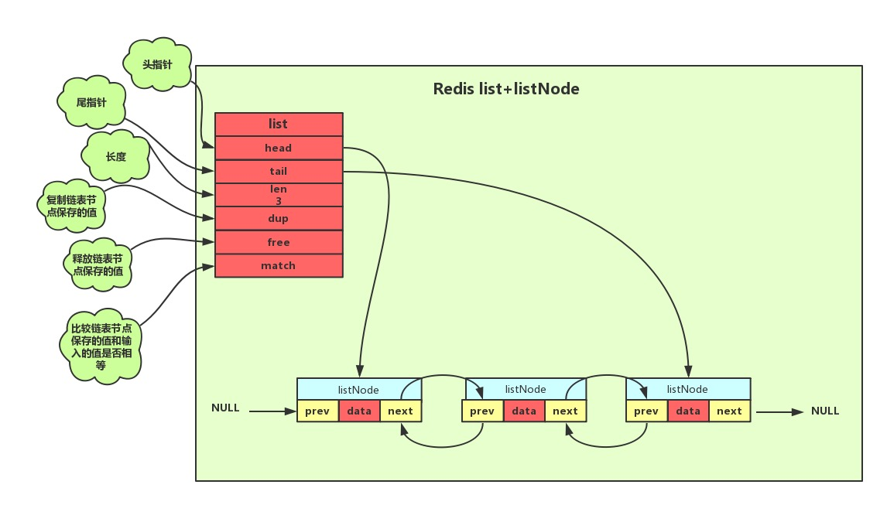
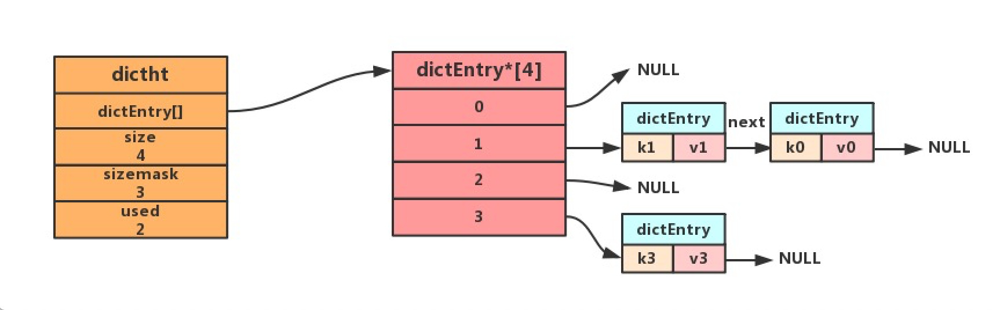

## 一、底层数据结构

#### 1.SDS(简单动态字符串)

[SDS字符串实现](https://www.cnblogs.com/hunternet/p/9957913.html)

redis没有使用C语言传统的字符串表示，自己建立了一种SDS的抽象类型，并用作默认字符串表示。

##### 1.数据结构:


##### 2.sds和c字符串区别

1.获取自身长度的复杂度不同，C字符串的复杂度为O(N)，sds是O(1)

原因在于sds的len属性中记录了自身长度

2.杜绝缓存区溢出

c字符串不记录自身长度，在修改时字符串可能超过自身能容纳的长度，造成溢出。sds空间分配策略，在修改时会检查空间是否满足不要求，不满足要求则先进行空间扩展

3.减少修改字符串带来的内存重分配次数

4.二进制安全

5.兼容部分C字符串函数


#### 2.链表

[链表实现](https://www.cnblogs.com/hunternet/p/9967279.html)

##### 1.数据结构



```
typedef struct listNode
{ 
	// 前置节点 
	struct listNode *prev; 
	// 后置节点 
	struct listNode *next; 
	// 节点的值 
	void *value; 
} listNode;
```

```
typedef struct list{
    //表头节点
    listNode *head;
    //表尾节点
    listNode *tail;
    //链表所包含的节点数量
    unsigned long len;
    //节点值复制函数
    void *(*dup)(void *ptr);
    //节点值释放函数
    void *(*free)(void *ptr);
    //节点值对比函数
    int (*match)(void *ptr,void *key);
}list;
```

##### 2.链表结构特性:

- 双向：链表节点带有前驱、后继指针获取某个节点的前驱、后继节点的时间复杂度为0(1)。
- 无环: 链表为非循环链表表头节点的前驱指针和表尾节点的后继指针都指向NULL，对链表的访问以NULL为终点。
- 带表头指针和表尾指针：通过list结构中的head和tail指针，获取表头和表尾节点的时间复杂度都为O(1)。
- 带链表长度计数器:通过list结构的len属性获取节点数量的时间复杂度为O(1)。
- 多态：链表节点使用void*指针保存节点的值，并且可以通过list结构的dup、free、match三个属性为节点值设置类型特定函数，所以链表可以用来保存各种不同类型的值。

#### 3.字典

[字典实现](https://www.cnblogs.com/hunternet/p/9989771.html)

  Redis字典使用散列表最为底层实现，一个散列表里面有多个散列表节点，每个散列表节点就保存了字典中的一个键值对。

##### 1.底层数据结构


```
typedef struct dict{
    //类型特定函数
    void *type;
    //私有数据
    void *privdata;
    //哈希表-见2.1.2
    dictht ht[2];
    //rehash 索引 当rehash不在进行时 值为-1
    int trehashidx; 
}dict;
```

```
typedef struct dictht
{
    //哈希表数组，C语言中，*号是为了表明该变量为指针，有几个* 号就相当于是几级指针，这里是二级指针，理解为指向指针的指针
    dictEntry **table;
    //哈希表大小
    unsigned long size;
    //哈希表大小掩码，用于计算索引值
    unsigned long sizemask;
    //该哈希已有节点的数量
    unsigned long used;
}dictht;
```

```
//哈希表节点定义dictEntry结构表示，每个dictEntry结构都保存着一个键值对。
typedef struct dictEntry
{
    //键
    void *key;
    //值
    union{
    void *val;
    uint64_tu64;
    int64_ts64;
    }v;
    // 指向下个哈希表节点，形成链表
    struct dictEntry *next;
}dictEntry;
```

##### 2.hash冲突处理方法(链表法)

当有两个或以上的键被分配到散列表数组同一个索引上时，就发生了键冲突。Redis使用链表法解决散列冲突。每个散列表节点都有一个next指针，多个散列表节点next可以用next指针构成一个单向链表，被分配到同一个索引上的多个节点可以使用这个单向链表连接起来。



#### 4.跳跃表

[跳跃表实现](https://www.cnblogs.com/hunternet/p/11248192.html)

##### 1.数据结构


##### 2.跳跃表定义


##### 3.跳跃表特性

- 跳跃表基于单链表加索引的方式实现
- 跳跃表以空间换时间的方式提升了查找速度
- Redis有序集合在节点元素较大或者元素数量较多时使用跳跃表实现
- Redis的跳跃表实现由 zskiplist和 zskiplistnode两个结构组成,其中 zskiplist用于保存跳跃表信息(比如表头节点、表尾节点、长度),而zskiplistnode则用于表示跳跃表节点
- Redis每个跳跃表节点的层高都是1至32之间的随机数
- 在同一个跳跃表中,多个节点可以包含相同的分值,但每个节点的成员对象必须是唯一的跳跃表中的节点按照分值大小进行排序,当分值相同时,节点按照成员对象的大小进行排序


#### 5.整数集合

[整数集合实现](https://www.cnblogs.com/hunternet/p/11268067.html)

##### 1.数据结构


##### 2.整数集合特性

- 整数集合是Redis自己设计的一种存储结构,集合键的底层实现之一。
- 整数集合的底层实现为数组,这个数组以有序、无重复的方式保存集合元素,在有需要时,程序会根据新添加元素的类型,改变这个数组的类型。
- 升级操作为整数集合带来了操作上的灵活性,并且尽可能地节约了内存。
- 整数集合只支持升级操作,不支持降级操作。
  

#### 6.压缩列表

[压缩列表实现](https://www.cnblogs.com/hunternet/p/11306690.html)

  压缩列表是Redis为了节约内存而开发的,是由一系列特殊编码的连续内存块组成的顺序型(sequential)数据结枃。一个压缩列表可以包含任意多个节点(entry),每个节点可以保持一个字节数组或一个整数值

##### 1.数据结构


##### 2.压缩列表特性

- 压缩列表被用作列表键和哈希键的底层实现之一。
- 压缩列表可以包含多个节点,每个节点可以保存一个字节数组或者整数值。
- 添加新节点到压缩列表,或者从压缩列表中删除节点,可能会引发连锁更新操作,但这种操作出现的几率并不高。


#### 7.快速列表

[快速列表](https://www.cnblogs.com/hunternet/p/12624691.html)

##### 1.数据结构


## 二、对象

#### 1.对象定义

##### 1.定义

  Redis中的每个对象都由一个redisObject结构表示,该结构中和保存数据有关的三个属性分别是type属性、 encoding属性和ptr属性:

```
typedef struct redisObiect{
	//类型
	unsigned type:4;
	//编码
	unsigned encoding:4;
	//指向底层数据结构的指针
	void *ptr;
}
```

##### 2.数据结构


3.特性

- Redis基于底层的一些数据结构创建了一个对象系统以供用户使用
- 这个系统主要包含字符串对象、列表对象、哈希对象、集合对象和有序集合对象
- Redis的键对象都是字符串对象
- Redis的值对象主要有字符串、哈希、列表、集合、有序集合几种
- 为了可以自由改进内部编码，以及在不同场景下发挥其最大优势，Redis中的对象，大都是通过多种数据结构来实现

#### 2.字符串对象

##### 1.数据结构


##### 2.定义

  字符串对象是 Redis 中最基本的数据类型,也是我们工作中最常用的数据类型。redis中的键都是字符串对象，而且其他几种数据结构都是在字符串对象基础上构建的。字符串对象的值实际可以是字符串、数字、甚至是二进制，最大不能超过512MB 。

#### 3.列表对象

##### 1.数据结构


##### 2.定义

列表（list）类型是用来存储多个有序的字符串，列表中的每个字符串称为元素(element)，一个列表最多可以存储232-1个元素。在Redis中，可以对列表两端插入（push）和弹出（pop），还可以获取指定范围的元素列表、获取指定索引下标的元素等。列表是一种比较灵活的数据结构，它可以充当栈和队列的角色，在实际开发上有很多应用场景。

##### 3.内部实现

在Redis3.2版本以前列表类型的内部编码有两种。

ziplist（压缩列表）：当列表的元素个数小于list-max-ziplist-entries配置（默认512个），同时列表中每个元素的值都小于list-max-ziplist-value配置时（默认64字节），Redis会选用ziplist来作为列表的内部实现来减少内存的使用。
linkedlist（链表）：当列表类型无法满足ziplist的条件时，Redis会使用linkedlist作为列表的内部实现。
而在Redis3.2版本开始对列表数据结构进行了改造，使用 quicklist 代替了 ziplist 和 linkedlist.

#### 4.哈希对象

##### 1.数据结构


##### 2.内部实现

哈希类型的内部编码有两种：ziplist(压缩列表),hashtable(哈希表)。只有当存储的数据量比较小的情况下，Redis 才使用压缩列表来实现字典类型。具体需要满足两个条件：

- 当哈希类型元素个数小于hash-max-ziplist-entries配置（默认512个）
- 所有值都小于hash-max-ziplist-value配置（默认64字节）
  ziplist使用更加紧凑的结构实现多个元素的连续存储，所以在节省内存方面比hashtable更加优秀。当哈希类型无法满足ziplist的条件时，Redis会使用hashtable作为哈希的内部实现，因为此时ziplist的读写效率会下降，而hashtable的读写时间复杂度为O（1）。
  有关ziplist和hashtable这两种redis底层数据结构的具体实现可以参考我的另外两篇文

#### 5.集合对象

##### 1.数据结构


##### 2.内部实现

- intset(整数集合):当集合中的元素都是整数且元素个数小于set-maxintset-entries配置（默认512个）时，Redis会选用intset来作为集合的内部实现，从而减少内存的使用。

- hashtable(哈希表):当集合类型无法满足intset的条件时，Redis会使用hashtable作为集合的内部实现。

#### 6.有序集合对象

##### 1.数据结构


##### 2.内部实现

有序集合是由 ziplist (压缩列表) 或 skiplist (跳跃表) 组成的。

当数据比较少时，有序集合使用的是 ziplist 存储的，有序集合使用 ziplist 格式存储必须满足以下两个条件：

- 有序集合保存的元素个数要小于 128 个；
- 有序集合保存的所有元素成员的长度都必须小于 64 字节。

如果不能满足以上两个条件中的任意一个，有序集合将会使用 skiplist 结构进行存储


