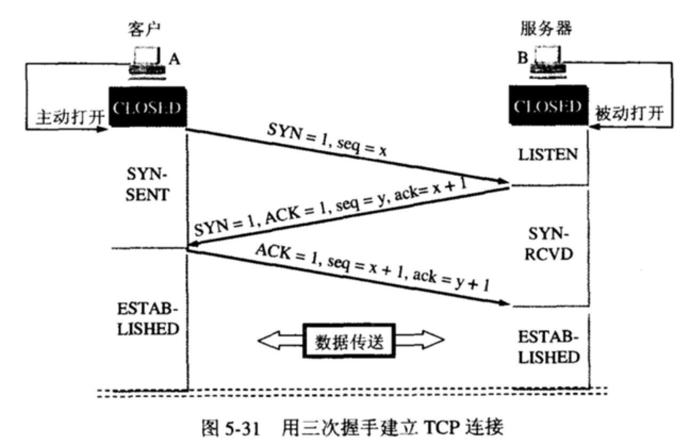

[常见面试题](https://zhuanlan.zhihu.com/p/340124149?utm_source=wechat_session&utm_medium=social&utm_oi=826014021646966784&utm_campaign=shareopn)

# 一、HTTP协议

## 1.HTTP报文结构

#### 1.请求报文

请求行由三部分组成：请求方法，请求URL（不包括域名），HTTP协议版本

请求头部由关键字/值对组成，每行一对

1. User-Agent : 产生请求的浏览器类型
2. Accept : 客户端希望接受的数据类型，比如 Accept：text/xml（application/json）表示希望接受到的是xml（json）类型
3. Content-Type：发送端发送的实体数据的数据类型。
   比如，Content-Type：text/html（application/json）表示发送的是html类型。
4. Host : 请求的主机名，允许多个域名同处一个IP地址，即虚拟主机

#### 2.响应报文

状态行也由三部分组成：服务器HTTP协议版本，响应状态码，状态码的文本描述

状态码：由3位数字组成，第一个数字定义了响应的类别

1xx：指示信息，表示请求已接收，继续处理

2xx：成功，表示请求已被成功接受，处理。

- 200 OK：客户端请求成功
- 204 No Content：无内容。服务器成功处理，但未返回内容。一般用在只是客户端向服务器发送信息，而服务器不用向客户端返回什么信息的情况。不会刷新页面。
- 206 Partial Content：服务器已经完成了部分GET请求（客户端进行了范围请求）。响应报文中包含Content-Range指定范围的实体内容

3xx：重定向

4xx：客户端错误

- 400 Bad Request：客户端请求有语法错误，服务器无法理解。
- 401 Unauthorized：请求未经授权，这个状态代码必须和WWW-Authenticate报头域一起使用。
- 403 Forbidden：服务器收到请求，但是拒绝提供服务
- 404 Not Found：请求资源不存在。比如，输入了错误的url
- 415 Unsupported media type：不支持的媒体类型

5xx：服务器端错误，服务器未能实现合法的请求。

- 500 Internal Server Error：服务器发生不可预期的错误。
- 503 Server Unavailable：服务器当前不能处理客户端的请求，一段时间后可能恢复正常，

## 2.HTTP1和HTTP2区别

[协议区别](https://www.cnblogs.com/gxw123/p/13288957.html?utm_source=tuicool)

Http2特点：

采用二进制格式而非文本格式；
完全多路复用，而非有序并阻塞的、只需一个连接即可实现并行；（解决了线头阻塞的问题，与Http1最重要的区别）
使用报头压缩，降低开销

区别：

1 二进制协议
HTTP/1.1 版的头信息肯定是文本（ASCII编码），数据体可以是文本，也可以是二进制。HTTP/2 则是一个彻底的二进制协议，头信息和数据体都是二进制，并且统称为”帧”：头信息帧和数据帧。
二进制协议解析起来更高效、“线上”更紧凑，更重要的是错误更少。

2 完全多路复用
HTTP/2 复用TCP连接，在一个连接里，客户端和浏览器都可以同时发送多个请求或回应，而且不用按照顺序一一对应，这样就避免了”队头堵塞”。

3 报头压缩
HTTP 协议是没有状态，导致每次请求都必须附上所有信息。所以，请求的很多头字段都是重复的，比如Cookie，一样的内容每次请求都必须附带，这会浪费很多带宽，也影响速度。
对于相同的头部，不必再通过请求发送，只需发送一次；
HTTP/2 对这一点做了优化，引入了头信息压缩机制；
一方面，头信息使用gzip或compress压缩后再发送；
另一方面，客户端和服务器同时维护一张头信息表，所有字段都会存入这个表，产生一个索引号，之后就不发送同样字段了，只需发送索引号。

## 3.HTTPS和HTTP区别

# 二、TCP/IP协议

## 1.TCP/IP四层+OSI七层模型

## 2.TCP三次握手和四次挥手

#### 1.三次握手

##### 1.基本概念:

首先Client端发送连接请求报文，Server段接受连接后回复ACK报文，并为这次连接分配资源。Client端接收到ACK报文后也向Server段发生ACK报文，并分配资源，这样TCP连接就建立了。

##### 2.交互图:

##### 3.过程:

- **第一次握手**：起初两端都处于CLOSED关闭状态，Client将标志位SYN置为1，随机产生一个值seq=x，并将该数据包发送给Server，Client进入SYN-SENT状态，等待Server确认；
- **第二次握手**：Server收到数据包后由标志位SYN=1得知Client请求建立连接，Server将标志位SYN和ACK都置为1，ack=x+1，随机产生一个值seq=y，并将该数据包发送给Client以确认连接请求，Server进入SYN-RCVD状态，此时操作系统为该TCP连接分配TCP缓存和变量；
- **第三次握手**：Client收到确认后，检查ack是否为x+1，ACK是否为1，如果正确则将标志位ACK置为1，ack=y+1，并且此时操作系统为该TCP连接分配TCP缓存和变量，并将该数据包发送给Server，Server检查ack是否为y+1，ACK是否为1，如果正确则连接建立成功，Client和Server进入ESTABLISHED状态，完成三次握手，随后Client和Server就可以开始传输数据。

##### 4.不能二次握手原因:

防止历史连接初始化了连接。

**case:** A发出了两个连接请求报文段，其中第一个丢失，第二个到达了B，但是第一个丢失的报文段只是在某些网络结点长时间滞留了，延误到连接释放以后的某个时间才到达B，此时B误认为A又发出一次新的连接请求，于是就向A发出确认报文段，同意建立连接，不采用三次握手，只要B发出确认，就建立新的连接了，此时A不理睬B的确认且不发送数据，则B一致等待A发送数据，浪费资源。

##### 5.Server端SYN攻击

服务器端的资源分配是在二次握手时分配的，而客户端的资源是在完成三次握手时分配的，所以服务器容易受到SYN洪泛攻击，SYN攻击就是Client在短时间内伪造大量不存在的IP地址，并向Server不断地发送SYN包，Server则回复确认包，并等待Client确认，由于源地址不存在，因此Server需要不断重发直至超时，这些伪造的SYN包将长时间占用未连接队列，导致正常的SYN请求因为队列满而被丢弃，从而引起网络拥塞甚至系统瘫痪。

防范SYN攻击措施：降低主机的等待时间使主机尽快的释放半连接的占用，短时间受到某IP的重复SYN则丢弃后续请求。

#### 2.四次挥手

##### 1.交互图

##### 2.四次挥手过程

1. A的应用进程先向其TCP发出连接释放报文段（**FIN=1，序号seq=u**），并停止再发送数据，主动关闭TCP连接，进入FIN-WAIT-1（终止等待1）状态，等待B的确认。
2. B收到连接释放报文段后即发出确认报文段，（**ACK=1，确认号ack=u+1，序号seq=v**），B进入CLOSE-WAIT（关闭等待）状态，此时的TCP处于半关闭状态，A到B的连接释放。
3. A收到B的确认后，进入FIN-WAIT-2（终止等待2）状态，等待B发出的连接释放报文段。
4. B没有要向A发出的数据，B发出连接释放报文段（**FIN=1，ACK=1，序号seq=w，确认号ack=u+1），**B进入LAST-ACK（最后确认）状态，等待A的确认。
5. A收到B的连接释放报文段后，对此发出确认报文段（**ACK=1，seq=u+1，ack=w+1**），A进入TIME-WAIT（时间等待）状态。此时TCP未释放掉，需要经过时间等待计时器设置的时间2MSL后，A才进入CLOSED状态。

##### 3.客户端在TIME-WAIT状态必须等待2MSL原因

MSL最长报文段寿命Maximum Segment Lifetime，MSL=2

1. 保证A发送的最后一个ACK报文段能够到达B。这个ACK报文段有可能丢失，使得处于LAST-ACK状态的B收不到对已发送的FIN+ACK报文段的确认，B超时重传FIN+ACK报文段，而A能在2MSL时间内收到这个重传的FIN+ACK报文段，接着A重传一次确认，重新启动2MSL计时器，最后A和B都进入到CLOSED状态，若A在TIME-WAIT状态不等待一段时间，而是发送完ACK报文段后立即释放连接，则无法收到B重传的FIN+ACK报文段，所以不会再发送一次确认报文段，则B无法正常进入到CLOSED状态。
2. 已失效的"连接请求报文段”出现在本连接中。A在发送完最后一个ACK报文段后，再经过2MSL，就可以使本连接持续的时间内所产生的所有报文段都从网络中消失，使下一个新的连接中不会出现这种旧的连接请求报文段。

##### 4.连接关闭四次握手原因

因为当Server端收到Client端的SYN连接请求报文后，可以直接发送SYN+ACK报文。其中ACK报文是用来应答的，SYN报文是用来同步的。但是关闭连接时，当Server端收到FIN报文时，很可能并不会立即关闭SOCKET，所以只能先回复一个ACK报文，告诉Client端，"你发的FIN报文我收到了"。只有等到我Server端所有的报文都发送完了，我才能发送FIN报文，因此不能一起发送。故需要四步握手

##### 5.TIME_WAIT状态需要经过2MSL(最大报文段生存时间)才能返回到CLOSE状态原因

虽然按道理，四个报文都发送完毕，我们可以直接进入CLOSE状态了，但是我们必须假象网络是不可靠的，有可以最后一个ACK丢失。所以TIME_WAIT状态就是用来重发可能丢失的ACK报文。

#### 2.TCP报文结构

#### 3.TCP保证传输过程的稳定性

#### 4.TCP和UDP区别

## 3.io多路复用

## 4.浏览器请求一个网址的过程

## 5.负载均衡实现方式

**DNS**：这是最简单的负载均衡的方式，一般用于实现地理级别的负载均衡，不同地域的用户通过DNS的解析可以返回不同的IP地址，这种方式的负载均衡简单，但是扩展性太差，控制权在域名服务商。

**Http重定向**：通过修改Http响应头的Location达到负载均衡的目的，Http的302重定向。这种方式对性能有影响，而且增加请求耗时。

**反向代理**：作用于应用层的模式，也被称作为**七层负载均衡**，比如常见的Nginx，性能一般可以达到万级。这种方式部署简单，成本低，而且容易扩展。

**IP**：作用于网络层的和传输层的模式，也被称作**四层负载均衡**，通过对数据包的IP地址和端口进行修改来达到负载均衡的效果。常见的有LVS（Linux Virtual Server），通常性能可以支持10万级并发。

按照类型来划分的话，还可以分成DNS负载均衡、硬件负载均衡、软件负载均衡。

其中硬件负载均衡价格昂贵，性能最好，能达到百万级，软件负载均衡包括Nginx、LVS这种。

## 6.BIO、NIO、AIO的区别

